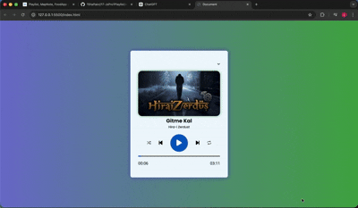

# JS-MUZIKCALAR

🎵 Müzik Çalar Web Uygulaması

Modern ve kullanıcı dostu bir web tabanlı müzik çalar uygulaması geliştirdim. Bu proje sayesinde kullanıcılar şarkıyı oynatabilir, duraklatabilir ve müzik süresini takip edebilir. Arayüzde minimal ve modern bir tasarım hedeflenmiştir.

🚀 Proje Özellikleri

🎧 Müzik oynatma ve duraklatma

⏮️ Önceki / Sonraki şarkı kontrolü

⏱️ Şarkı süresi ve ilerleme çubuğu

🎨 Modern ve responsive tasarım

📱 Mobil uyumlu arayüz

🧠 Bu Projede Neler Öğrendim?

Bu projeyi geliştirirken aşağıdaki konularda pratik kazandım:

JavaScript ile DOM Manipülasyonu

Audio API kullanımı

Event Listener ile kullanıcı etkileşimi

Progress bar ile zaman kontrolü

Responsive UI tasarımı

Frontend proje yapısı ve düzeni

Ayrıca kullanıcı deneyimini artırmak için basit ama etkili bir UI tasarımı oluşturmayı öğrendim.

🛠️ Kullandığım Teknolojiler

Bu projeyi geliştirirken aşağıdaki teknolojileri kullandım:

HTML5 – Sayfa yapısı

CSS3 – Stil ve tasarım

JavaScript (Vanilla JS) – Uygulama mantığı

HTML Audio API – Müzik oynatma işlemleri

Responsive Design – Mobil uyumluluk

📌 Projeden Kazandıklarım

Bu proje sayesinde:

Frontend geliştirme pratiğimi geliştirdim

JavaScript ile gerçek bir uygulama geliştirme deneyimi kazandım

UI/UX tasarımında daha iyi düşünmeyi öğrendim

GitHub üzerinde proje dokümantasyonu hazırlama pratiği yaptım

# EKRAN GÖRÜNTÜSÜ

